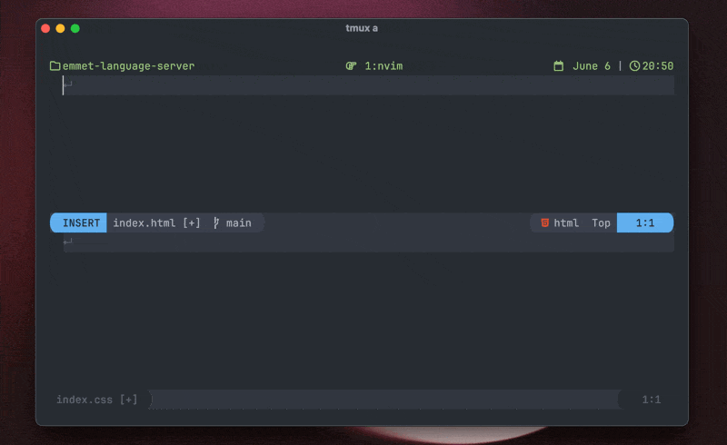

<!-- markdownlint-disable MD033 MD041 -->
<div align="center">
    
    <h3>emmet-language-server</h3>
    <p>A language server for <a href="https://emmet.io/" target="_blank">emmet.io</a></p>
</div>



---

### Why another language server?

While [aca/emmet-ls](https://github.com/aca/emmet-ls) works for what I need, there were a couple of things that annoyed me from time to time and while trying to fix one of those things (aca/emmet-ls#55) I've discovered that we can leverage [microsoft/vscode-emmet-helper](https://github.com/microsoft/vscode-emmet-helper) and make a simple language server that wraps that package to provide completions.

So I decided to do that and it worked!

The most important thing is that [microsoft/vscode](https://github.com/microsoft/vscode) has an excellent integration with emmet and we can have that, in all editors that implement the [Language Server Protocol](https://microsoft.github.io/language-server-protocol/).

### Installation

#### npm

```sh
npm i -g @olrtg/emmet-language-server
```

#### mason.nvim

```sh
:MasonInstall emmet-language-server
```

### Configuration

The server accepts the following [Emmet configuration options](https://code.visualstudio.com/docs/editor/emmet#_emmet-configuration) through the LSP `initializationOptions` field. All options are optional; if an editor sends no initialization options, the effective defaults below are used.

These are server options. Editor-specific options such as the command, filetypes, and workspace root belong to the LSP client configuration instead.

| Option | Type | Default | Description |
| --- | --- | --- | --- |
| `includeLanguages` | `Record<string, string>` | `{}` | Maps an editor language ID to another Emmet-supported syntax. This does not cause the language server to attach to that language. |
| `excludeLanguages` | `string[]` | `[]` | Disables Emmet completions for the listed language IDs after the server starts. Neovim users should generally remove unwanted languages from `filetypes` instead, avoiding an unnecessary server attachment. |
| `extensionsPath` | `string[]` | `[]` | Lists directories containing Emmet customizations such as `snippets.json` and `syntaxProfiles.json`. Relative paths are resolved from the server's working directory. |
| `preferences` | `Record<string, unknown>` | `{}` | Customizes [Emmet preferences](https://docs.emmet.io/customization/preferences/) that affect expansion and output. |
| `showAbbreviationSuggestions` | `boolean` | `false` | Adds other matching Emmet abbreviations to the completion list alongside the current expansion. |
| `showExpandedAbbreviation` | `"always" \| "never"` | `"always"` | Controls whether expanded abbreviations are offered as completions. |
| `showSuggestionsAsSnippets` | `boolean` | `false` | Marks Emmet completion items as snippets, which may affect how the editor sorts or filters them. |
| `syntaxProfiles` | `Record<string, unknown>` | `{}` | Overrides [output rules](https://docs.emmet.io/customization/syntax-profiles/) for individual syntaxes. |
| `variables` | `Record<string, string>` | `{}` | Defines [variables](https://docs.emmet.io/customization/snippets/#variables) available while expanding abbreviations. |

### Editor setup

#### Neovim

> [!NOTE]
> Want deeper integration (eg. wrap with abbreviation)? Check out [nvim-emmet](https://github.com/olrtg/nvim-emmet).

These examples use the `vim.lsp.config` API available in Neovim 0.11 and later.

##### With nvim-lspconfig

[`nvim-lspconfig`](https://github.com/neovim/nvim-lspconfig) provides an [`emmet_language_server` configuration](https://github.com/neovim/nvim-lspconfig/blob/master/lsp/emmet_language_server.lua) with the command, filetypes, and root markers already defined. If you do not need to override anything, enable it directly:

```lua
vim.lsp.enable("emmet_language_server")
```

To customize it, extend the configuration before enabling it. Any omitted initialization options retain the defaults from the table above.

```lua
vim.lsp.config("emmet_language_server", {
  init_options = {
    showSuggestionsAsSnippets = true,
  },
})

vim.lsp.enable("emmet_language_server")
```

##### Without nvim-lspconfig

Without `nvim-lspconfig`, Neovim still needs a client configuration that tells it how and when to start the server. The following example mirrors the current [`nvim-lspconfig` defaults](https://github.com/neovim/nvim-lspconfig/blob/master/lsp/emmet_language_server.lua):

```lua
vim.lsp.config("emmet_language_server", {
  cmd = { "emmet-language-server", "--stdio" },
  filetypes = {
    "astro",
    "css",
    "eruby",
    "html",
    "htmlangular",
    "htmldjango",
    "javascriptreact",
    "less",
    "sass",
    "scss",
    "svelte",
    "typescriptreact",
    "vue",
  },
  root_markers = { ".git" },
})

vim.lsp.enable("emmet_language_server")
```

Add `init_options` to this configuration if you want to override any of the server defaults.

#### Zed

Install the [Emmet extension](https://zed.dev/extensions/emmet) from the Zed Extension Gallery. The extension downloads and updates `emmet-language-server` automatically, so a separate npm or Mason installation is not required.

No additional configuration is necessary. To override the server defaults, add initialization options to your Zed `settings.json`:

```json
{
  "lsp": {
    "emmet-language-server": {
      "initialization_options": {
        "showSuggestionsAsSnippets": true
      }
    }
  }
}
```

See [Zed's Emmet documentation](https://zed.dev/docs/languages/emmet) for more information.

#### Helix

Install normally with npm (or your favourite package manager), then add the following to `languages.toml`:

```toml
[language-server.emmet-lsp]
command = "emmet-language-server"
args = ["--stdio"]

[language-server.emmet-lsp.config]
showSuggestionsAsSnippets = true

[[language]]
name = "html"
roots = [".git"]
language-servers = ["emmet-lsp"]
```

Omit the `[language-server.emmet-lsp.config]` table to use the server defaults.

### Credits

- [@aca](https://github.com/aca) for the first language server ([aca/emmet-ls](https://github.com/aca/emmet-ls))
- [@wassimk](https://github.com/wassimk) for bringing the [microsoft/vscode-emmet-helper](https://github.com/microsoft/vscode-emmet-helper) repo to my attention in aca/emmet-ls#55
- [microsoft/vscode](https://github.com/microsoft/vscode) for having such an amazing integration with emmet and the easy and open package to integrate with
- [emmetio/emmet](https://github.com/emmetio/emmet) for the awesome tool
